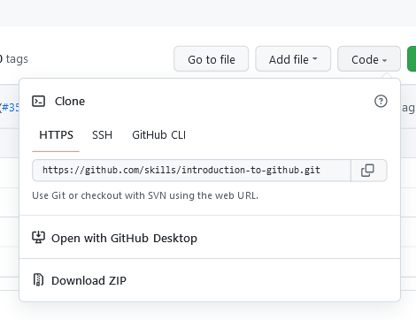

You have selected an advanced option and will work git in terminal! You are courageous and awesome! :sunglasses:

Let's dive in!

## Step 1: Create a repository in GitHub

Follow the guide and set up the repository: [click](https://docs.github.com/en/get-started/quickstart/create-a-repo)

Stop once you have a repository. No need to go through `Commit your first change` part.

## Step 2: Create a local folder
Create a folder on your desktop called  `ReDiGitTutorial`. Using the command line, navigate to your new project's location. For example:
```bash
cd desktop
cd ReDiGitTutorial
```

## Step 3: Add README file
Either create a text file and save it in the folder as `README.md` or run the following command in the terminal and see the file appearing in the folder.
```bash
touch README.md
```

**What is a profile README?**: A [profile README](https://docs.github.com/account-and-profile/setting-up-and-managing-your-github-profile/customizing-your-profile/managing-your-profile-readme) is essentially an "About me" section on your GitHub profile where you can share information about yourself with the community on GitHub.com. GitHub shows your profile README at the top of your profile page.

## Step 4: Connect your folder to the repository
Now it is time to do an actual git work! :keyboard:

 `git init` command initializes a brand new Git repository and begins tracking an existing directory. It adds a hidden subfolder within the existing directory that houses the internal data structure required for version control. Let's run it:
 ```bash
git init
```

Now we can link your local directory to the  remote GitHub repository. A `remote` is Git's fancy way of saying "the place where your code is stored." That URL could be your repository on GitHub, or another user's fork, or even on a completely different server.

Copy the link of the repository you created in the `Step 1` . Click on the `Code` button and choose either HTTPS or SSH depending on your git configuration:



Now run:
 ```bash
git remote add origin https://github.com/YOURLINK.git
```
You have a git repo set up locally! :fire:

## Step 5: Create a branch

**What is a branch?**: A [branch](https://docs.github.com/en/get-started/quickstart/github-glossary#branch) is a parallel version of your repository. By default, your repository has one branch named `main` and it is considered to be the definitive branch. You can create additional branches off of `main` in your repository. You can use branches to have different versions of a project at one time.

On additional branches, you can make edits without impacting the `main` version. Branches allow you to separate your work from the `main` branch. In other words, everyone's work is safe while you contribute.

To create a new branch run:
 ```bash
git checkout -b my-first-branch
```

_You created a branch! :tada:_

## Step 6: Commit
 Creating a branch allows you to edit your project without changing the `main` branch. Now that you have a branch, it’s time to create a change and make your first commit!

 Let's change `README.md` file. We will use our knowledge of the terminal for this:
```bash
echo "# This is my first commit!" >> README.md
```

Now we can talk about commits.

 **What is a commit?**: A [commit](https://docs.github.com/pull-requests/committing-changes-to-your-project/creating-and-editing-commits/about-commits) is a set of changes to the files and folders in your project. A commit exists in a branch.

The following steps will guide you through the process of committing a change on GitHub. Committing a change requires first adding a new file to your new branch:
```bash
git add README.md
```

`git add` stages a change. Git tracks changes to a developer's codebase, but it's necessary to stage and take a snapshot of the changes to include them in the project's history. This command performs staging, the first part of that two-step process. Any changes that are staged will become a part of the next snapshot and a part of the project's history. Staging and committing separately gives developers complete control over the history of their project without changing how they code and work.

`git commit` saves the snapshot to the project history and completes the change-tracking process. In short, a commit functions like taking a photo. Anything that's been staged with `git add` will become a part of the snapshot with `git commit`.
For commits, you can enter a short commit message that describes what changes you made. This message helps others know what's included in your commit.
```bash
git commit -m "Add readme file"
```


We are almost there. :wave: Now we just need to add our changes to the remote GitHub repository:
```bash
git push -u origin my-first-branch
```


Success! :sparkles: You have finished tasks on the local side.

## Step 7: Pull request
Follow the Step 3 and Step 4 from this guide: [click](https://github.com/skills/introduction-to-github#step-3-open-a-pull-request):
- Create pull request from your branch to `main`
- Merge your pull request
- Celebrate your victory! :dancers:


## Sourses
This guide heavily uses

https://docs.github.com

https://github.com/skills/introduction-to-github